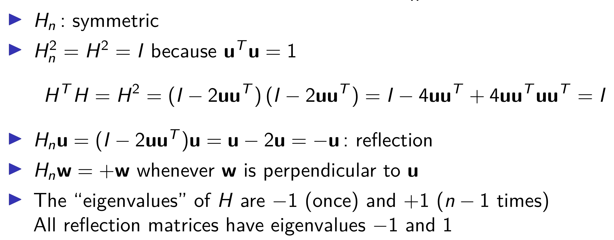

# Special Matrix
{: .no_toc }

## Table of contents
{: .no_toc .text-delta }

- TOC
{:toc}

---

## 0. Symmetric Matrix
1. Properties
    - $\forall \lambda$ : real
    - $\exists \{x_i\}$ : orthonormal and full (spans $V$). ($\implies$ diagonalizable : spectral thm. )  
2. Spectral Theorem

$$ S = Q \Lambda Q^T $$

## 1. Orthogonal Matrix
: transpose rather than inverse

0. Rectangular
$Q$ : tall thin matrix with orthonormal columns ($m \times n, m \gt n$)

$$Q^TQ = I_n$$

$$QQ^T = \begin{bmatrix} I_n & O\phantom{_{m-n}} \\ O & O_{m-n} \end{bmatrix} \ne I_m$$

$$\forall \mathbf{x}, \lVert Q\mathbf{x} \rVert = \lVert \mathbf{x} \rVert$$ 

1. Definition (~~Orthonomal Matrix~~)  
    - $Q$ : square matrix with orthonormal columns ($n \times n$)
2. iff conditions
    - $Q^TQ = QQ^T = I_n$
3. Properties
    - $Q_1, Q_2 \text{ : orthogonal} \implies Q_1Q_2 \text{ : orthogonal}$
    - $ \lVert Q\mathbf{x} \rVert = \lVert \mathbf{x} \rVert $ : isometry
    - orthogonal $\implies$ rotation

## 2. Hadamard Matrix (아다마르 행렬)
1. Definition, notation
    - $H_n$ : entries are $\pm 1$, and rows/columns are mutually orthogonal.  
2. Properties
    - $H_n$ is not orthogonal. (scalar multipled orthogonal matrix)
3. Hadamard Conjecture
    - $H_n$ exists iff $n \equiv 0 (\text{mod } 4)$

## 3. Projection Matrix → Least Square Error

$$ P : R^n \xrightarrow{\text{proj}} C(P) $$

$$ P : \mathbf{b} \mapsto P\mathbf{b} $$

1. Definition
    - $P$ : square matrix $s.t.$ $P^2=P$ : idempotent
    - "projection twice = projection once"
2. Definition (Orthogonal Projection Matrix)
    - $P^2 = P = P^T$ : idempotent and symmetric

$$\begin{align*} 
    P^2 = P = P^T &\iff 
    \forall \mathbf{v}, \ P^T\mathbf{v} = P\mathbf{v} = P^2\mathbf{v} \\ &\implies 
    \forall \mathbf{v}, \ P^T(\mathbf{v}-P\mathbf{v}) = P(\mathbf{v}-P\mathbf{v}) = P\mathbf{v}-P^2\mathbf{v} = \mathbf{0} \\ &\iff 
    \forall v \forall p_i, \ p_i \cdot (\mathbf{v}-P\mathbf{v}) = 0 \\ &\iff
    \forall v, \ \forall p_i \perp (\mathbf{v}-P\mathbf{v}) \\ &\iff
    C(P) \perp (\mathbf{v}-P\mathbf{v}) \\ &\iff
    P\mathbf{v} \text{ is an orthogonal projection of } \mathbf{v} \text{ on } C(P)
\end{align*}$$

## 4. Rotation and Reflection

$$
Q_{\text{rotate}} = 
\begin{bmatrix}
    cos\theta & -sin\theta \\
    sin\theta & \ \ \ cos\theta
\end{bmatrix}
\text{ : rotate } \theta \quad
$$

$$
Q_{\text{reflect}} = 
\begin{bmatrix}
    cos2\theta & \ \ \ sin2\theta \\
    sin2\theta & -cos2\theta
\end{bmatrix}
\text{ : rotate } \pi + 2\theta
$$

- rotation $\times$ rotation : rotation
- reflection $\times$ reflection : rotation
- rotation $\times$ reflection : reflection

## 5. Householder Matrix

$$H_n = I_n - 2\mathbf{u}\mathbf{u^T}$$ 

where $\mathbf{u}$ is a unit vector

- Properties :  

