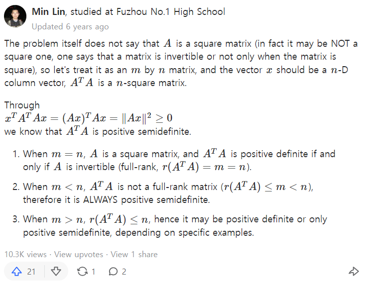

# (Symmetric) Positive Definite Matrix
{: .no_toc }

## Table of contents
{: .no_toc .text-delta }

- TOC
{:toc}

---

## 0. Calculus on Manifolds - Differentiation

$$ \overrightarrow{\mathbf{f}} : \mathbf{R}^n \rightarrow \mathbf{R}^m $$

$$ \overrightarrow{\mathbf{x}} \in \mathbf{R}^n : \text{domain}f $$

$$ \frac{\partial \overrightarrow{\mathbf{f}}}{\partial \overrightarrow{\mathbf{x}}} = 
    \begin{bmatrix}
        \vert & & \vert \\
        \frac{\partial f_1}{\partial \overrightarrow{\mathbf{x}}} & \cdots & \frac{\partial f_m}{\partial \overrightarrow{\mathbf{x}}}\\
        \vert & & \vert \\
    \end{bmatrix} 
    \text{ : always based on the denominator vectors}
$$

## 0+. examples

$$ \frac{\partial f}{\partial \overrightarrow{\mathbf{x}}} = 
    \begin{bmatrix}
        \vert \\
        \frac{\partial f}{\partial \overrightarrow{\mathbf{x}}} \\
        \vert \\
    \end{bmatrix} 
    \text{ : } 
    \frac{\partial \text{scalar}}{\partial \text{vector}}
$$

$$ \frac{\partial \overrightarrow{\mathbf{f}}}{\partial x} = 
    \begin{bmatrix}
        \frac{\partial f_1}{\partial x} & \cdots & \frac{\partial f_m}{\partial x}
    \end{bmatrix} 
    \text{ : } 
    \frac{\partial \text{vector}}{\partial \text{scalar}}
$$

$$ \frac{\partial \overrightarrow{\mathbf{f}}}{\partial \overrightarrow{\mathbf{x}}} = 
    \begin{bmatrix}
        \frac{\partial f_1}{\partial x_1} & \frac{\partial f_2}{\partial x_1} & \cdots & \frac{\partial f_m}{\partial x_1} \\
        \frac{\partial f_1}{\partial x_2} & \frac{\partial f_2}{\partial x_2} & \cdots & \frac{\partial f_m}{\partial x_2} \\
        \vdots & \vdots & \ddots & \vdots \\
        \frac{\partial f_1}{\partial x_n} & \frac{\partial f_2}{\partial x_n} & \cdots & \frac{\partial f_m}{\partial x_n} \\
    \end{bmatrix} 
    \text{ : } 
    \frac{\partial \text{vector}}{\partial \text{vector}}
    \text{ (Jacobian)}
$$

## 1. Hessian Matrix

$$ f : \mathbf{R}^n \rightarrow \mathbf{R} \text{ (scalar)}$$

$$ \nabla f = 
    \frac{\partial{f}}{\partial{\overrightarrow{\mathbf{x}}}} =
    \begin{bmatrix}
        \vert \\
        \frac{\partial f}{\partial \overrightarrow{\mathbf{x}}} \\
        \vert \\
    \end{bmatrix} 
    \text{ : 1st derivative }
$$

$$ 
\begin{align*}
    H &= 
    \begin{bmatrix}
        \vert & \vert & & \vert \\
        \frac{\partial}{\partial \overrightarrow{\mathbf{x}}} \left( \frac{\partial f}{\partial \overrightarrow{\mathbf{x}}} \right)_1 & 
        \frac{\partial}{\partial \overrightarrow{\mathbf{x}}} \left( \frac{\partial f}{\partial \overrightarrow{\mathbf{x}}} \right)_2
         & \cdots &
        \frac{\partial}{\partial \overrightarrow{\mathbf{x}}} \left( \frac{\partial f}{\partial \overrightarrow{\mathbf{x}}} \right)_n\\
        \vert & \vert & & \vert \\
    \end{bmatrix} 
    \text{ : 2nd derivative.} \\

    & =
    \begin{bmatrix}
        \dfrac{\partial^2 f}{\partial x_1^2} & \dfrac{\partial^2 f}{\partial x_1 \partial x_2} & \cdots & \dfrac{\partial^2 f}{\partial x_1 \partial x_n} \\
        \dfrac{\partial^2 f}{\partial x_2 \partial x_1} & \dfrac{\partial^2 f}{\partial x_2^2} & \cdots & \dfrac{\partial^2 f}{\partial x_2 \partial x_n} \\
        \vdots & \vdots & \ddots & \vdots \\
        \dfrac{\partial^2 f}{\partial x_n \partial x_1} & \dfrac{\partial^2 f}{\partial x_n \partial x_2} & \cdots & \dfrac{\partial^2 f}{\partial x_n^2} \\
    \end{bmatrix} 

    \quad \text{Note that }
    \left( \tfrac{\partial f}{\partial \overrightarrow{\mathbf{x}}} \right)_i
    =
    \tfrac{\partial f}{\partial x_i}
    \text{ : vector} 
\end{align*}
$$

## 2. Geometric Meaning of Hessian

View Hessian matrix $H$ as a **linear transformation**.  
Let $\lambda$ and $\mathbf{x}$ be eigenvalues and corresponding eigenvectors of $H$.  
Then $H\mathbf{x} = \lambda \mathbf{x}$ : direction of $\mathbf{x}$ doesn't change.  
$\mathbf{x}$ represent the principal axis of transformation. (direction)  
$\lambda$ represent the degree of transformation. (positive : convex / negative)  

Thus,  

|eigenvalues|shape of the graph||
|:---:|:---:|:---:|
| $\forall \lambda > 0$ |convex|positive definite|
| $\exists \lambda > 0$   $\exists \lambda < 0$ |saddle|indefinite|
| $\forall \lambda < 0$ |concave|negative definite|

## 3. Test for Positive Definiteness (iff conditions)
Let $S$ be a (symmetric) positive definite matrix. Then follows are equivalent.  
① $ \forall \lambda > 0 $  
② $ \forall \mathbf{x} \ne 0, \ \mathbf{x}^TS\mathbf{x} > 0 $ (Definition)  
③ $ \exists A \ s.t. \ S=A^TA $ where $A$ has independent columns.  
④ $ \forall D_i > 0 $ where $D_i$ is a leading principal minor (determinant of a leading principal submatrix).  
⑤ $ \forall \text{pivot} > 0$  

## 4. Properties
1. positive definite $\implies$ invertible  
pf) For nonzero $\mathbf{x}$, if $H\mathbf{x}=\mathbf{0}$ then $H$ has a $0$ eigenvalue. ▨

2. If positive definiteness contains symmetry, then has full independent eigenvectors by symmetry.  
But if not, then doesn't.  
counterexample : $ M = \begin{pmatrix} 1 & 0.1 \\\\ 0 & 1 \end{pmatrix} $ is positive definite, but has only $\lambda=1, \ \mathbf{x}=(1, 0)$

3. $A^TA$, $AA^T$ : positive semi-definite.  
pf) $x^TA^TAx = <Ax, Ax> = ||Ax|| \ge 0.$ By letting $A^T = B$, $AA^T$ is also.  

4. Is $A^TA$ positive definite? : No!  

5. 
