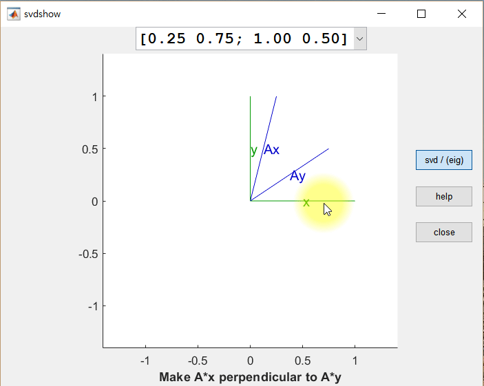
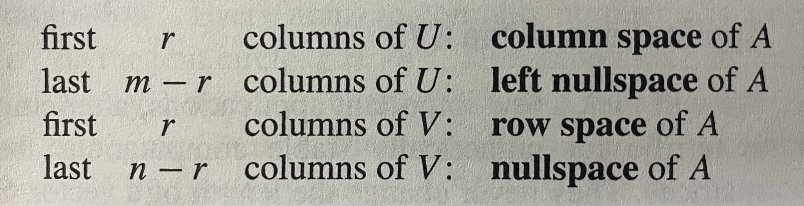

# Signular Value Decomposition
{: .no_toc }

## Table of contents
{: .no_toc .text-delta }

- TOC
{:toc}

---

\: LU decomposition + QR decomposition (elimination + orthogonalization)  
\: generalized eigenvalue decomposition

## 1. Theorem

$$\forall A, \exists(U, \Sigma, V) \ s.t. \ AV=U\Sigma$$

$A_{m \times n}$ : rectangular matrix with $\text{rank}(A)=r$  
$V_{n \times n}$ : orthogonal square matrix  
$U_{m \times m}$ : orthogonal square matrix  
$\Sigma_{m \times n}$ : diagonal rectangular matrix with 'singular value $\sigma_i$'

$$ \implies A = U \Sigma V^T $$

## 1.5. reduced form

$$ A\mathbf{v}_1 = \sigma_1 \mathbf{u}_1, \ \cdots, \ A\mathbf{v}_r = \sigma_r \mathbf{u}_r, \quad A\mathbf{v}_{r+1} = \sigma_{r+1} \mathbf{u}_{r+1}=\mathbf{0}, \ \cdots, \ A\mathbf{v}_n = \sigma_n \mathbf{u}_n = \mathbf{0}$$

$$ A = U \Sigma V^T = U_r \Sigma_r V_r^T$$

$A_{m \times n}$  
$U_{m \times r}$ → orthonormal basis of $C(A)$  
$\Sigma_{r \times r}$  
$V_{r \times n}$ → orthonormal basis of $C(A^T)$  

## 2. Geometric Interpretation
- $ A = U \Sigma V^T $ : orthogonal $\times$ diagonal $\times$ orthogonal  
$\implies$ rotation $\times$ vertical/horizontal stretching $\times$ rotation **: iso-angle**
- orthonormal vector set $\xrightarrow{A\text{:linear transform}}$ orthogonal vector set (scalar $\sigma_i$ multipled orthonormal)

## 3. Eckart-Young Theorem

$$ \lVert A-A_k \rVert \le \lVert A-B \rVert \text{ for } \forall B \text{ : } \text{rank}(B)=k $$

$ A_k = \sum_{i=1}^k \sigma_i \mathbf{u}_i \mathbf{v}_i^T $ : obtained by SVD  
$A$ is the nearest matrix with rank $k$.

## 4. Proof Sketch
- $\text{diag}(\Sigma)$ : $\sqrt{r \text{ nonzero eigenvalues of }A^TA \text{ and } AA^T} $  
- $V$ : orthogonal eigenvector matrix of $A^TA$ $\Leftarrow A^TA = V \Sigma^T \Sigma V^T$ ($A^TA$ : symmetric)  
- $U$ : orthogonal eigenvector matrix of $AA^T$ $\Leftarrow AA^T = U \Sigma \Sigma^T U^T$ ($AA^T$ : symmetric)  

## 5. Properties
- $AV=U\Sigma \implies A^TU=V\Sigma$ : $A$ 와 $A^T$ 는 $U, V$ 바꾼 관계
- $S$ : symmetric positive definite $\implies S=Q \Lambda Q^T = U \Sigma V^T$ : diagonalization(EVD) = SVD  
( $Q=U=V, \ \Lambda = \Sigma$ )
- $Q$ : orthogonal $\implies Q^TQ=I$ : $\forall \lambda=1, \ \Sigma=I$
- *uniqueness : SVD is unique upto ~~~~~*
- $A$ : square $\implies \forall \lvert \lambda \rvert \le \sigma _1$
- $A=\mathbf{xy}^T$ : rank $1$ $\implies \mathbf{u}_1 = \dfrac{\mathbf{x}}{\lVert \mathbf{x} \rVert}, \quad \mathbf{v}_1 = \dfrac{\mathbf{y}}{\lVert \mathbf{y} \rVert}, $  
$\lvert \lambda_1 \rvert = \lvert \mathbf{y}^T\mathbf{x} \rvert \le \sigma_1 = \lVert \mathbf{y} \rVert \ \lVert \mathbf{x} \rVert $  : Schwarz inequality
- $U, V$ gives orthonormal basis for all 4 Fundamental Subspaces

## Reference
- Gilbert Strang, LINEAR ALGEBRA AND ITS APPLICATIONS (4th)
- https://angeloyeo.github.io/2019/08/01/SVD.html
